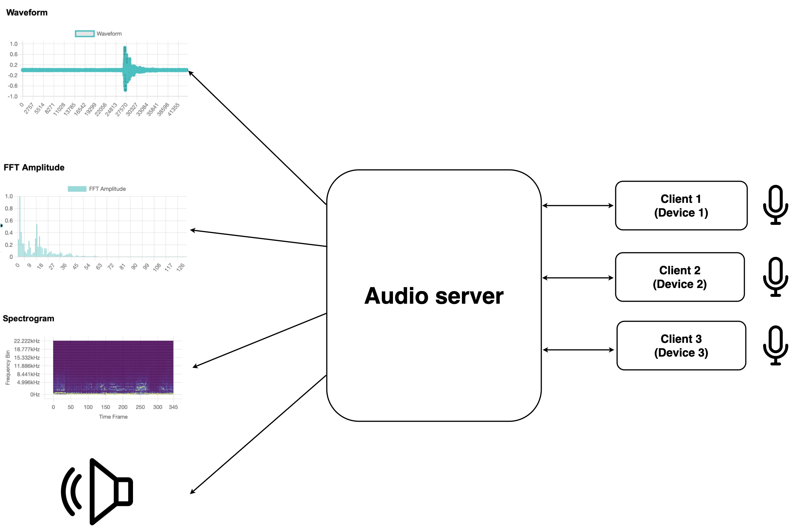

# Audio server to record devices


This repository is for recording and streaming multi devices in remote through network. Audio server can connect multiple devices. It follows below sequences.

1. Stop server
2. Start server
3. If client have a connection with server, then it will show microphone's list
4. Set Microphone from client
5. Server get client's microphone stream
6. If starting record, then after stop record, you can save the stream as wav file in local path.
7. [TBD] Streaming device's microphone to speaker is only supported in the device which have streaming microphone and speaker. there's some crackling sound if streaming from remote microphone to speaker.

The server can run,

```shell
cd server
python app.py
```

The client can run,

```shell
cd client
python client.py
```

## System



## TODO BUG
### Server
- The server should always stop server and after that, it can start server
- Every modification in app.py make disconnection in client
- microphone and speaker list in web is not consistantly maintained. The selection can be applied, but the selection is not saved in local, but only in client side.
- Multiple device connection
- Streaming microphone from remote device to server speaker has crackling sound. It works only in the case which the audio server have streaming microphone and speaker. 

### Client
- Exception to set input audio devices
